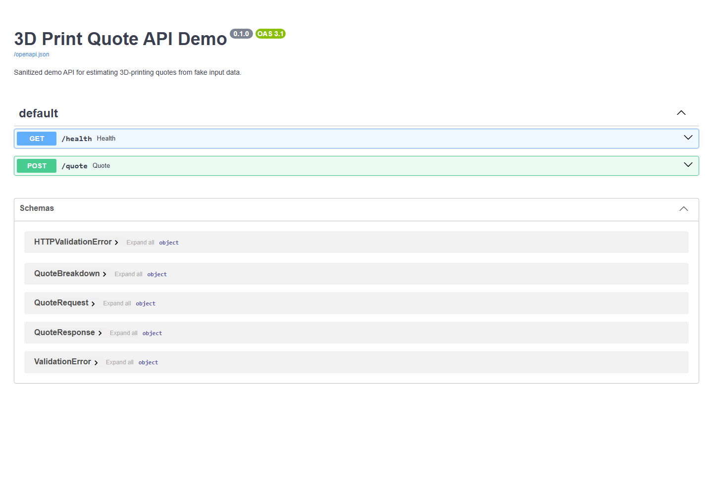
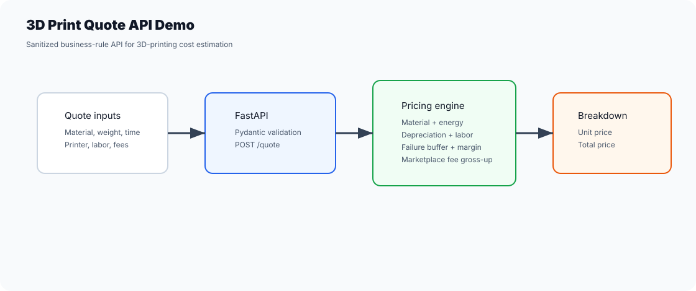

# 3D Print Quote API Demo

Sanitized FastAPI demo for calculating 3D-printing quotes from fake business inputs.

## Screenshot





This repo is based on real 3D-printing quoting lessons, but it contains no customer data, no private database, no brand assets and no production secrets.

## What It Shows

- Backend API design with FastAPI and Pydantic.
- Pricing logic for material, energy, depreciation, maintenance, labor, packaging, failure buffer, profit margin and marketplace fee.
- Validation for unsafe inputs such as invalid marketplace fee percentages.
- Tests around the pricing engine and API contract.
- GitHub Actions CI for the test suite.

## Run Locally

```bash
python -m venv .venv
.venv\Scripts\activate
python -m pip install -r requirements.txt
python -m uvicorn app.main:app --reload
```

Open:

```text
http://127.0.0.1:8000/docs
```

## Example Request

```bash
curl -X POST http://127.0.0.1:8000/quote \
  -H "Content-Type: application/json" \
  -d "{\"material_name\":\"PLA\",\"filament_spool_price\":100,\"filament_spool_weight_g\":1000,\"part_weight_g\":50,\"print_hours\":5,\"printer_power_w\":100,\"electricity_price_kwh\":1,\"printer_price\":2500,\"printer_lifetime_hours\":2500,\"maintenance_cost_per_hour\":0.5,\"labor_minutes\":30,\"labor_hour_price\":30,\"packaging_cost\":4,\"failure_rate_percent\":10,\"profit_margin_percent\":40,\"marketplace_fee_percent\":20,\"quantity\":2}"
```

## Test

```bash
pytest
```

## Portfolio Notes

This is intentionally small and focused. It is meant to show how I turn a real operational workflow into a safe public demo with clear business rules, validation, tests and documentation.
